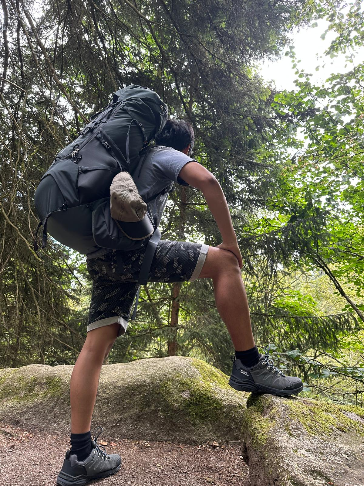

# Peter Ngo
Hallo ich bin der **Peter**. :smile:

## Mein Arbeitgeber
Mein Arbeitgeber ist _Dr.sc.ETH_ Ronald Tanner. Er ist Software Architekt bei [Semafor](https://www.semafor.ch/de/).
Er ist immer der erste im Büro.
Unsere Kunden sind vielfältig. Unsere Schwerpunkt liegt in der Entwicklung Wissenschaftlicher Applikationen.

### Cloud Erfahrung
Ich habe wenig direkte Erfahrung, da bei uns in der Firma die Webapplikation automatisch miterstellt wird bei der Entwicklung, wenn ich Docker zum laufen bringe werden sowohl Datenbanken als auch die Webapplikation automatisch geregelt.

#### Skript-Sprachen
Ich weiss nicht ob **_LATEX_** zu skript sprachen gehört. Aber ich liebe es mit Latex zu schreiben. Da wir in der Firma mit Latex schreiben, fühle ich mich ziemlich wohl. Ich schreibe alles mit Latex. Von Liebesbriefen, Gedichte etc. 

#### Meine Hobbies Outdoor:
- Motorradfahren
- Martial Arts
    - Kung-Fu
- Fotografieren
- Wandern
- Gym
- Zelten
- Trekken
- Velofahren

#### Meine Hobbies Indoor:
1. Lesen
2. Gedicht schreiben
3. Klavier 
4. Singen
5. Gamen
6. Meditieren

Mein Ziel ist es in Zukunft einen Stabiles einkommen zu kriegen.
Mein wunsch ist es Informatiker und Kung-Fu Meister zu werden. Irgendwann selber eine Kung-Fu schule zu eröffnen und die Menschen zu helfen ihre Wege im Leben zu finden und ein erfülltes Leben führen.
Ausserdem spende ich mindestens 1 Mal im Jahr Geld für bedürftige Kinder bei [Petite Suisse](https://www.petitesuisse.ch/), da Kinder unsere zukunft sind und jedes Kind verdient glücklich zu sein.
